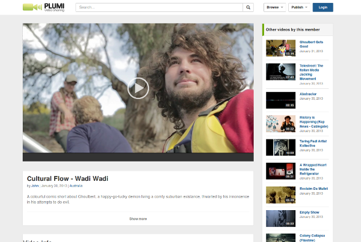

Plumi free software video sharing web app
=========================================
Το Plumi είναι λογισμικό ανοιχτού κώδικα για τη δημιουργία video web portals. Παρέχει ένα λειτουργικό
σύνολο από προχωρημένα χαρακτηριστικά τα οποία επιτρέπουν τη δημιουργία portal στα οποία
φιλοξενούνται, αρχειοθετούνται και είναι διαθέσιμα προς προβολή videos. Ουσιαστικά επιτρέπει τη
δημιουργία κόμβων τύπου youtube στα οποία οι διαχειριστές των κόμβων αυτών έχουν τον πλήρη έλεγχο
και αποφεύγονται οι περιορισμοί που βάζουν τα μεγάλα εμπορικά video συστήματα (διαφημίσεις,
λογοκρισία, όρια στο μέγεθος, όρια στην ποιότητα/τύπο αρχείων κτλ). Είναι ιδανική λύση για δημιουργία
video portals με υψηλό βαθμό εξειδίκευσης (πχ κοινότητες, σχολεία, εκπαίδευση), είτε για περιβάλλοντα με
ανάγκες περιορισμού της πρόσβασης στο υλικό (πχ intranets, εταιρίες, δημόσιο).

Τεχνικά στοιχεία
================
Το Plumi είναι υλοποιημένο σε Python και πάνω στο CMS Plone. Η εγκατάσταση γίνεται με το σύστημα buildout της Python και το λογισμικό χειρίζεται ο supervisord

Μονάδες Αριστείας ΕΛ/ΛΑΚ
========================
Τα παραδοτέα με αφορμή τη συμμετοχή στις ΜΑ της ΕΛ/ΛΑΚ θα είναι τα εξης:

* Απλοποίηση της εγκατάστασης και έλεγχος λειτουργίας σε σύγχρονα περιβάλλοντα
* Διόρθωση προβλημάτων και αναβάθμιση εκδόσεων
* Βελτιώσεις στην τεκμηρίωση (documentation)
* Αισθητικές επεμβάσεις

Για όποιες αλλαγές θα ανοίξουμε pull requests στο upstram repository του plumi project

Εικόνες
=======

index page (καινούργιο theme)

.. image:: screenshots/index.png
    :alt: index page (καινούργιο theme)
    :width: 700
    :align: center

index page (υπάρχον theme)

.. image:: screenshots/current-index.png
    :alt: index page (υπάρχον theme)
    :width: 700
    :align: center

video page (καινούργιο theme)

search page (καινούργιο theme)

video page σε mobile συσκευή (καινούργιο theme)

.. image:: screenshots/mobile.png
    :alt: video page σε mobile συσκευή (καινούργιο theme)
    :width: 500
    :height: 608
    :align: center

Εγκατάσταση
===========

Οι οδηγίες εγκατάστασης του plumi portal είναι για DEBIAN 8, το οποίο στην περίπτωση μας δημιουργήσαμε στον cloud provider Digital Ocean::

    $ ssh root@46.101.47.180
    root@plumi:~# lsb_release  -a
    Release:    8.2
    Codename:   jessie

Αρχικά φροντίζουμε το σύστημα να είναι up to date και εγκαθιστούμε τα απαραίτητα system packages::

    root@plumi:~# apt-get update; apt-get upgrade -y
    root@plumi:~# apt-get install -y build-essential pkg-config git-core python-dev libjpeg62-turbo-dev zlib1g-dev libxslt1-dev groff-base python-virtualenv vim libssl-dev

Στη συνέχεια κανουμε clone το plumi και εγκαθιστούμε ενα virtual environment της python για να το εγκαταστήσουμε μέσα::

    root@plumi:~# cd /home/
    root@plumi:/home# git clone https://github.com/ellak-monades-aristeias/plumi
    root@plumi:/home# cd plumi
    root@plumi:/home/plumi# virtualenv .

Προσθέτουμε τον χρήστη zope ο οποίος θα τρέχει το plumi, αν θέλουμε ο χρήστης να είναι διαφορετικός κάνουμε edit το αρχείο site.cfg και ορίζουμε εκεί το χρήστη.::

    root@plumi:/home/plumi# adduser zope

Θα χρειαστεί επίσης να κάνουμε την εξής αλλαγή στο site.cfg::

    www-server-name = plumi.gr
    www-videoserver-name = videos.plumi.gr

όπου ορίζουμε 2 hostnames για το portal μας, το plumi.gr θα είναι ο web server και ο video server το videos.plumi.gr

Τα hostname μας πρέπει να αντιστοιχούν στο μηχάνημα αυτό και συγκεκριμένα πρέπει να υπάρχουν εγγραφές για τα 3 domain names (για την περίπτωση μας): plumi.gr,  videos.plumi.gr, www.plumi.gr. Αν δεν έχουμε πρόσβαση σε dns server τουλάχιστον θα πρέπει να ορίσουμε στο ίδιο το μηχάνημα τα 3 αυτά hostnames, όπω επίσης και στο /etc/hosts του συστήματος απο το οποίο θα έχουμε πρόσβαση στο video portal.

Προχωράμε με την εγκατάσταση, όπου θα τρέξουμε το buildout 2 φορές, μια στον φάκελο ffmpeg και μια στο plumi::

    root@plumi:/home/plumi# cd ffmpeg/
    root@plumi:/home/plumi/ffmpeg# ../bin/python bootstrap.py
    root@plumi:/home/plumi/ffmpeg# ./bin/buildout -v

και αφού αυτό ολοκληρώσει::

    root@plumi:/home/plumi# ./bin/python bootstrap.py
    root@plumi:/home/plumi# ./bin/buildout -v

Αν το buildout σπάσει κάποια στιγμή το ξανατρέχουμε και τη δεύτερη φορά ολοκληρώνει χωρίς προβλήματα.

Αφού τελειώσει το buildout τρέχουμε τις εξής εντολές::

    root@plumi:/home/plumi# mkdir var/.python-eggs && chown -R zope. var/.python-eggs && chown -R zope. parts/cache parts/varnish-build
    root@plumi:/home/plumi# PYTHON_EGG_CACHE="/home/plumi/var/.python-eggs"
    root@plumi:/home/plumi# export PYTHON_EGG_CACHE
    root@plumi:/home/plumi# ./bin/supervisord

και τσεκάρουμε οτι όλες οι υπηρεσίες είναι σε κατάσταση runing::

    root@plumi:/home/plumi# ./bin/supervisorctl status
    cache                            RUNNING   pid 29754, uptime 2:50:01
    nginx                            RUNNING   pid 29755, uptime 2:50:01
    ploneftp                         RUNNING   pid 29753, uptime 2:50:01
    transcodedaemon                  RUNNING   pid 29752, uptime 2:50:01
    uwsgi                            RUNNING   pid 29750, uptime 2:50:01
    worker                           RUNNING   pid 29834, uptime 2:48:02
    zeo                              RUNNING   pid 29749, uptime 2:50:01

Μπορούμε να προσθέσουμε στο /etc/rc.local για να ξεκινάει αυτόματα το plumi::

    cd /home/plumi && PYTHON_EGG_CACHE="/home/plumi/var/.python-eggs" && export PYTHON_EGG_CACHE && ./bin/supervisord

Αναλυτικές οδηγίες υπάρχουν επίσης στο https://mgogoulos.trinket.io/plumi-4-5#/installation/basic-setup-after-installation

Demo
====

Demo του plumi υπάρχει στο http://demo.plumi.org

Παραδοτέα
=========

1. Απλοποίηση της εγκατάστασης και έλεγχος λειτουργίας σε σύγχρονα περιβάλλοντα  - https://github.com/ellak-monades-aristeias/plumi/blob/master/README.rst
2. Διόρθωση προβλημάτων και αναβάθμιση εκδόσεων -  https://github.com/ellak-monades-aristeias/plumi/blob/master/buildout.cfg
3. Βελτιώσεις στην τεκμηρίωση (documentation)  - https://github.com/ellak-monades-aristeias/plumi/blob/master/README.rst
4. Αισθητικές επεμβάσεις – καινούργιο theme  - https://github.com/ellak-monades-aristeias/plumi/tree/master/new-theme

